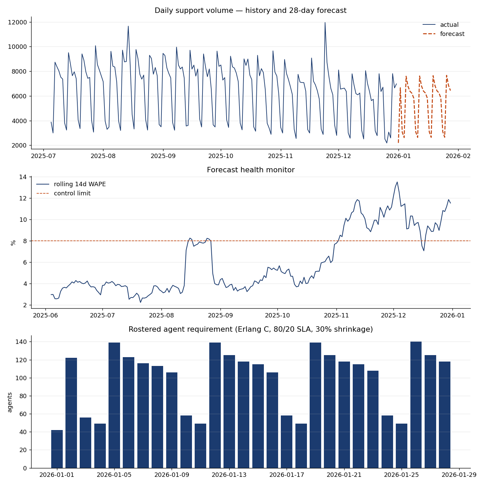

# Support Volume Forecasting & Capacity Planning

Daily contact-volume forecasting for a support operation, with the two things a
forecast usually lacks: a way to tell whether it is still working, and a
translation into how many people to roster.

Volume forecast → **Erlang C** staffing requirement → **forecast health monitoring** →
**variance root-cause** → automated review note.



---

## Why this, and not just a model

Most forecasting projects stop at a WAPE figure. In an operational setting that
is the least interesting output, because it answers none of the questions the
people using it actually have:

| Question | Where it is answered |
|---|---|
| How many contacts next month? | `src/forecast.py` |
| How many agents does that mean? | `src/capacity.py` |
| Is the model still trustworthy this week? | `src/accuracy.py` — health monitor |
| The forecast missed. Is that fixable? | `src/accuracy.py` — variance decomposition |
| What does a 3% error cost us? | `src/capacity.py` — `cost_of_error` |
| Who writes the weekly note? | `src/commentary.py` |

---

## Results

Rolling-origin backtest, 8 folds × 28-day horizon, 224 evaluated days:

| Model | WAPE | Note |
|---|---|---|
| **SARIMA (2,1,2)(1,1,1,7) + holiday regressors** | **5.90%** | selected |
| Seasonal naive | 7.80% | baseline |
| Holt-Winters | 9.82% | |

**24% improvement over the baseline.** That comparison is the point — a model
that cannot beat "same weekday last week" is not worth maintaining, and plenty
of production forecasts quietly do not.

**Holiday regressors were the deciding factor.** Without them SARIMA scored
8.08% and *lost to the naive baseline*. Holidays are large, they move year to
year, and they are known in advance — a model that has to learn a weekly
pattern which predictably breaks several times a year cannot do either job
well. Adding three features (`is_holiday`, `pre_holiday`, `post_holiday`) moved
WAPE by more than any change of model family did.

### What the health monitor caught

The pipeline flags its own selected model:

- Rolling 14-day WAPE breaches the 8% control limit through Q4
- Tracking signal at the window maximum — **every day in the last 28 was over-forecast**
- Overall bias +2.86%

That bias is small as a percentage and expensive as a roster: **238 agent-days
over-staffed and 0 under-staffed** in the most recent fold. Restating accuracy
in agent-days rather than percentages is what makes it legible to whoever signs
off the headcount.

### Variance root-cause

| Cause | Share of absolute error |
|---|---|
| Unexplained residual | 52.7% |
| Systematic day-of-week bias | 39.8% |
| Incident spikes | 7.5% |

The 39.8% is the actionable number. A day-of-week effect the model repeats
every week is a specification problem, not noise — it can be corrected. The
7.5% from incidents cannot be forecast and should be excluded from accuracy
targets, but excluding it without reporting it would be hiding it.

---

## Modelling decisions worth defending

**WAPE, not MAPE, as the headline.** MAPE divides by the actual, so low-volume
weekend days dominate the mean and a model can look poor while performing well
on the weekdays that carry the staffing cost. WAPE weights by volume.

**Bias tracked separately from magnitude.** A model can be accurate in size and
still consistently under-forecast, and that is the error that understaffs a
queue. Magnitude and direction are different failure modes with different
consequences.

**Rolling-origin backtest, not a single holdout.** Each fold trains only on data
available at that origin, so the result reflects what the model would have
produced in production. A single holdout hides how performance varies across
the year — and in this series it varies a lot.

**Incident spikes winsorised before fitting, not deleted.** Spikes are
non-repeating, so leaving them in training teaches a seasonality that does not
exist. They are capped against a rolling median/MAD band — MAD rather than
standard deviation, because the spikes inflate the standard deviation and mask
each other.

**Tracking signal scoped to a 28-day window.** Computed over full history the
statistic grows with sample size and stops being comparable to the conventional
|TS| > 4 threshold. The question is "is it drifting *now*".

---

## Erlang C and its limits

`src/capacity.py` implements Erlang C via the stable Erlang B recursion — the
closed form overflows at realistic agent counts. Staffing solves for the
minimum agents holding an 80/20 service level under an 85% occupancy cap, then
grosses up for 30% shrinkage.

The gap between the raw Erlang requirement and the rostered number is
routinely the thing that gets forgotten, so both are returned.

**Assumptions, stated because they are the model's real weakness:**

- Poisson arrivals within the interval — bursty traffic breaks this
- Exponential handle times
- **No abandonment**, so staffing is conservative; real queues shed load
- Daily volume spread evenly across operating hours, which **understates the
  intraday peak**. Real WFM applies an arrival curve. This plan is optimistic
  at peak and the reader should know that.

Erlang A (Palm) relaxes the abandonment assumption and is the natural next step
if this carried real headcount decisions.

---

## The automated commentary layer

`src/commentary.py` writes the weekly forecast review note. The recurring
manual task in a forecasting function is not building models — it is writing
the same narrative every week. That task is high-volume, low-variance and
template-shaped, which makes it the right thing to automate.

**The ordering is deliberate.** A deterministic rule layer decides *what is
true* and which exceptions are worth raising; the LLM is used only for the
final translation into prose, constrained to the figures in the evidence pack.
Letting the model do the reasoning would put unverifiable numbers in front of a
planner — the exact failure mode that stops teams trusting automated reporting.

The layer degrades to templated prose from the same rules if no API key is
set, and never breaks the pipeline: the numbers are the deliverable, the prose
is a convenience.

---

## Running it

```bash
pip install -r requirements.txt
python run_pipeline.py          # full pipeline, writes to outputs/
streamlit run app.py            # interactive scenario view
```

Optional, for LLM-written commentary rather than templated:

```bash
export ANTHROPIC_API_KEY=sk-...
```

---

## Data

Synthetic, seeded, generated by `src/data.py` — three years of daily volume
with growth trend, day-of-week and annual seasonality, Irish public holidays,
a product-launch step change, incident spikes, and AHT drifting independently
of volume.

Synthetic by design: it means the ground truth is known, so the variance
decomposition can be checked against the incidents that were actually injected
rather than assumed. Every figure above is reproducible from the seed.

---

## Structure

```
src/data.py         synthetic generator + holiday regressors
src/forecast.py     SARIMA / Holt-Winters / seasonal naive, rolling-origin backtest
src/accuracy.py     WAPE, bias, tracking signal, health monitor, variance decomposition
src/capacity.py     Erlang C, staffing plan, cost of forecast error in agent-days
src/commentary.py   rule layer + LLM narrative
run_pipeline.py     orchestration
app.py              Streamlit scenario interface
```

Stack: Python, pandas, statsmodels, matplotlib, Streamlit.
